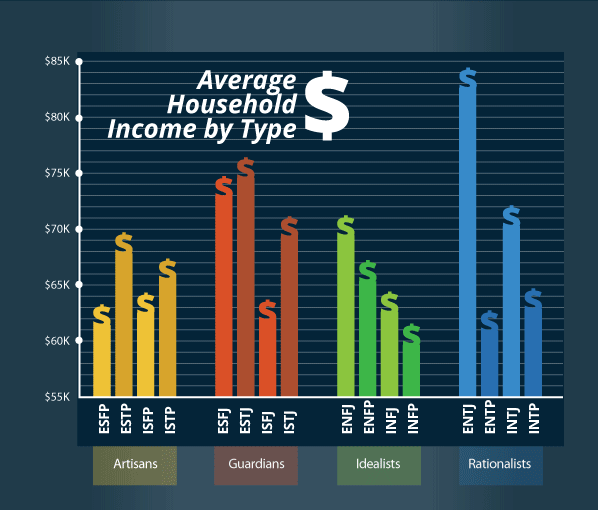
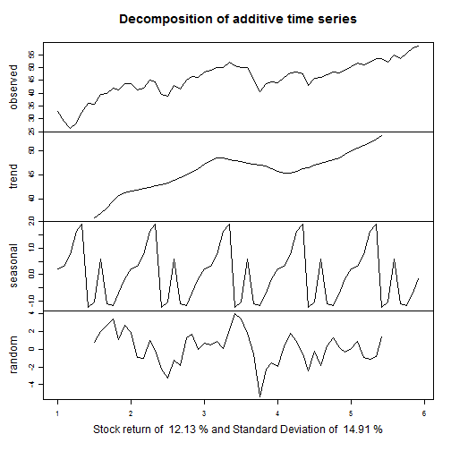
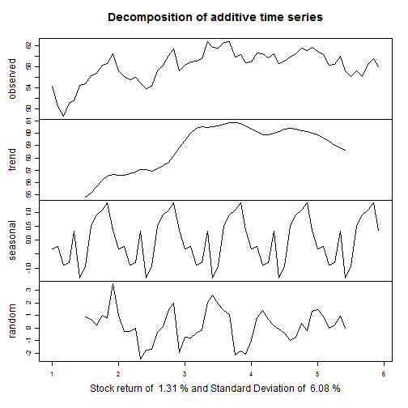
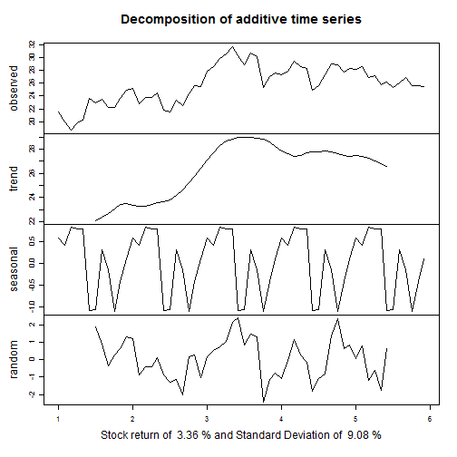
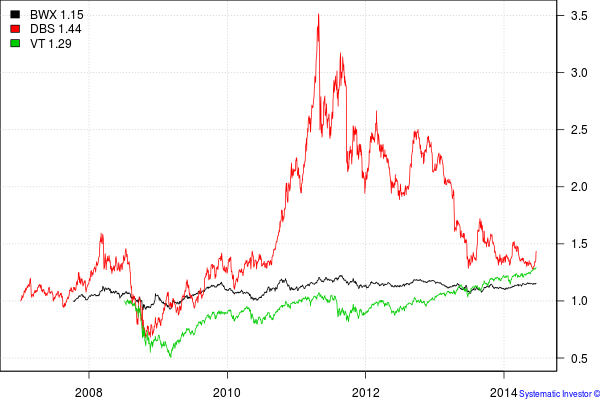

## Overview

1. Personal Introduction
2. Fundamental building blocks of financial independence.
3. Enhancing your Income
4. Saving more money
5. Investing for beginners
6. How to retire before 40.
7. Issues to consider before leaving the workforce.

--- .class #id 

## Personal Introduction

1. Trained as an electrical engineer in 1999.
2. Studied finance part-time in 2001 - Passed CFA exams in 2003.
3. Published 3 books in personal finance while working as an IT project manager in P&G, HP, SMX, NTUC and IDA.
4. Became financially independent at age 39. 
5. Will start law school this August.

---

## Fundamental Building blocks of financial independence

1. State of affairs where investment income exceeds living expenses. 
2. You can ramp down your work, reinvent yourself or simply do nothing with your life.
3. Requires three skills of earning, saving and investing.

---

## Enhancing your earnings.

1. First key skill - enhancing your earnings.
2. Know what job suits your personality - take the Gallup Strengthfinder. Know your MBTI. Know your OCEAN. 
3. Manuever your career to at least 8% increments. Perform better, work overtime. 
4. Increase business revenue, reduce business costs.
5. If HR policy permits, moonlight.
6. Build an app, write a book. 

---

## Effects on personality on income.

<div style='text-align: center;'>
    
</div>

---

## Saving more money

1. Second key skill - totally within your personal control.
2. Examine your monthly expenses. YNAB
3. Cut down non-essential expenses. ( Eliminate vices, consolidate fixed expenses )
4. Downgrade aggressively. Starbucks -> Kopitiam. Restaurant -> Hawker Centres
5. Develop cheap hobbies like reading. Read about investment.

---

## Investing for beginners

1. Some risk must be taken to overcome inflation.
2. Consider equity performance for your portfolio.
3. Beginners can balance a portfolio among equities, bond and commodities.
4. Observe concepts of risk and return. ( See Shiny App )

---

## Behavior of World Equities

 

```
## NULL
```


---

## Behavior of World Bonds

 

```
## NULL
```


---

## Behavior of Commodities

 

```
## NULL
```


---

## Correlation

1. Correlation between stocks and bonds : 0.6553079
2. Correlation between stocks and commodities : 0.7229404
3. Correlation between bonds and commodities : 0.553332

<div style='text-align: center;'>
    
</div>


---

## How to Retire before 40.

1. Stay with parents, stay single longer.
2. Employ REITs, business trusts and high yielding equities to target 6-9% dividend yields.
3. Use dividends to offset living expenses.
4. Invest your salary into the markets. 
5. Aim to live solely on dividend income.
6. Meet life goals of building a family.

Eg. $300,000 portfolio yielding 8% will give $24,000 a year ir $2,000 a month. This can sustain a single man. 

* Need to comply with Securities and Futures Act. Cannot advise on which stock to buy.

---

## Issues to consider before leaving the workforce.

1. This process will usually take 15 years for a fresh graduate.
2. Work will take up most of your life.
3. You will need to consider your personal identity.
4. How to spend your time meaningfully.
5. You can buy happiness with money but that is also a skill set.

---

## Financial Independence is within your reach. 

1. Work hard.
2. Save Aggressively
3. Know how to invest your money.

Any questions ?

---


